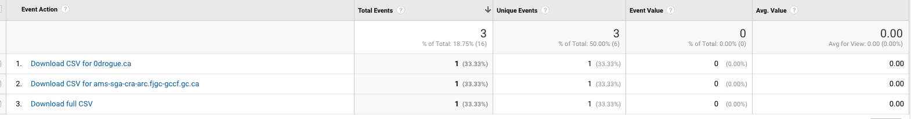

# Google Analytics

This project includes a Google Analytics set up with custom events for CSV downloads and clicking Organization links, to track what data users are looking at/searching for. To make use of Google Analytics, you will have to create your own Google Analytics account and plug your new UA code in the `gtag('config')` function in `templates/includes/head.html`. Everything else should work automatically.

Two custom events are included to help track how users are interacting with the product. 

## CSV Download
